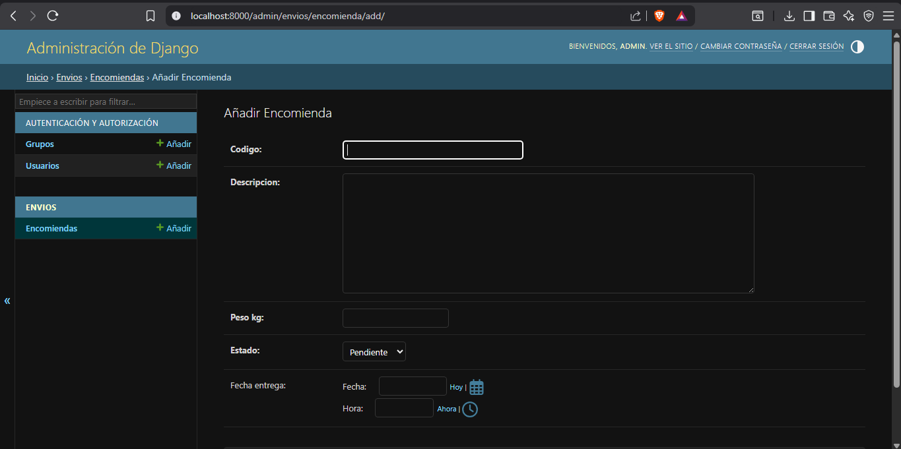

# Sistema de Encomiendas 📦



Este es un proyecto de gestión de encomiendas y paquetería desarrollado con **Django 6** y **PostgreSQL**, completamente contenerizado usando **Docker** y **Docker Compose**.

El sistema permite rastrear envíos, manejar diferentes estados de paquetes (Pendiente, En tránsito, Entregado, Devuelto) y gestionar clientes y rutas.

## 🛠️ Tecnologías

* **Backend:** Python 3.12, Django 6.0.4
* **Base de Datos:** PostgreSQL 15
* **Infraestructura:** Docker, Docker Compose
* **Gestión de Entorno:** `python-decouple`

## 📁 Estructura del Proyecto

```text
encomiendas/
├── clientes/           # App de gestión de clientes
├── config/             # Configuración principal de Django (settings, urls)
├── envios/             # App principal para gestión de paquetes y estados
├── media/              # Archivos multimedia subidos por usuarios
├── rutas/              # App para gestión de trayectos y logística
├── .env                # Variables de entorno (no incluido en repo)
├── docker-compose.yml  # Orquestación de servicios (web, db)
├── Dockerfile          # Instrucciones para la imagen de Django
├── manage.py           # Script principal de Django
└── requirements.txt    # Dependencias de Python
```

## 🚀 Comandos de Uso (Docker)

Asegúrate de tener Docker Desktop instalado y corriendo. El proyecto utiliza un archivo `.env` en la raíz para las credenciales de la base de datos.

### 1. Construir e iniciar los servicios

Levanta los contenedores en segundo plano (detached mode):

```bash
docker compose up --build -d
```

### 2. Aplicar migraciones

Crea las tablas necesarias en la base de datos PostgreSQL:

```bash
docker compose exec web python manage.py migrate
```

### 3. Crear un Superusuario (Administrador)

Para poder acceder al panel de administración de Django (`/admin`):

```bash
docker compose exec web python manage.py createsuperuser
```

### 4. Ver los logs en tiempo real

Si necesitas ver qué está pasando con el servidor web:

```bash
docker compose logs -f web
```

### 5. Apagar los servicios

Detiene todos los contenedores sin borrar los datos de la base de datos:

```bash
docker compose down
```

*Nota: Si deseas borrar la base de datos y empezar de cero, usa `docker compose down -v`.*

## 🌐 Acceso al Sistema

Una vez que los contenedores estén corriendo, puedes acceder a:

* **Sitio Principal:** [http://localhost:8000/](http://localhost:8000/)
* **Panel de Administración:** [http://localhost:8000/admin](http://localhost:8000/admin)
