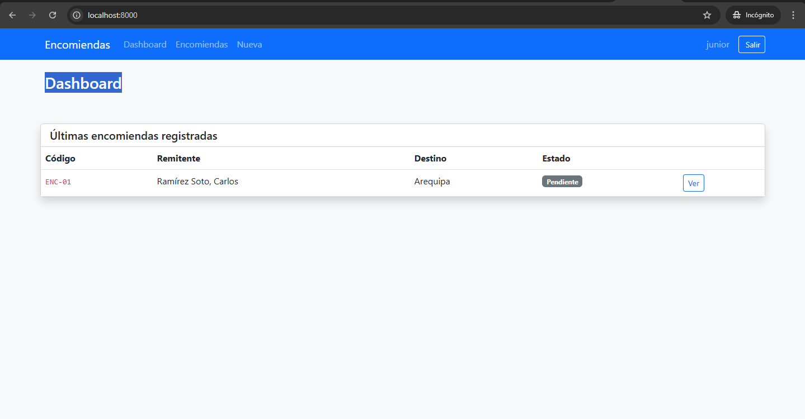
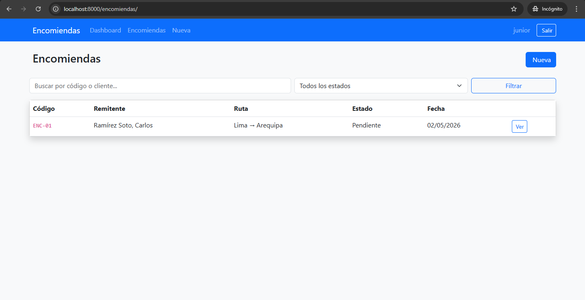
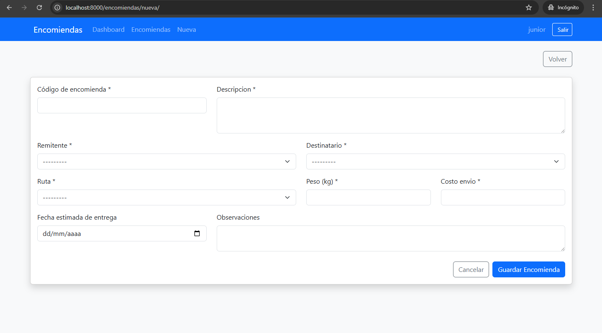
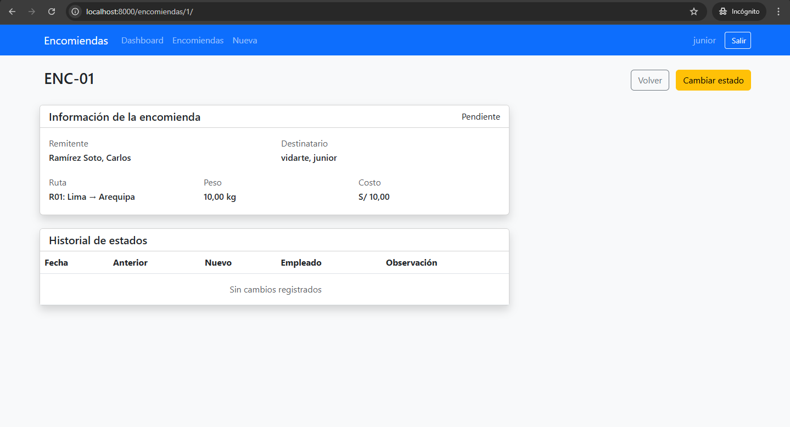
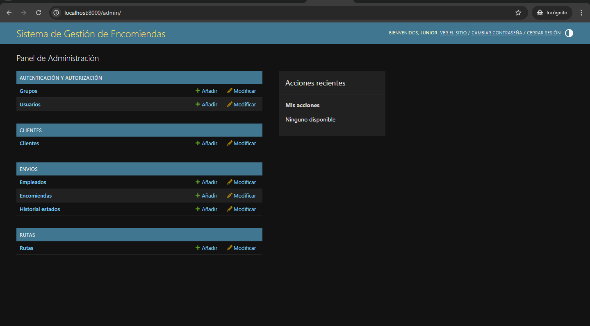
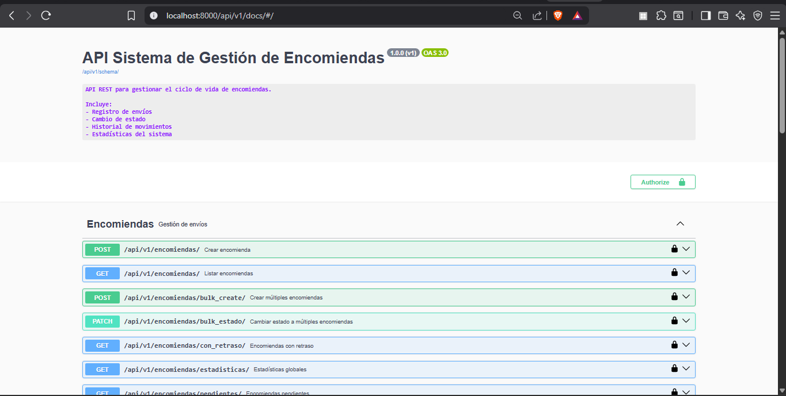

# Sistema de Encomiendas 📦



Este es un proyecto de gestión de encomiendas y paquetería desarrollado con **Django 6** y **PostgreSQL**, completamente contenerizado usando **Docker** y **Docker Compose**.

El sistema permite rastrear envíos, manejar diferentes estados de paquetes (Pendiente, En tránsito, Entregado, Devuelto) y gestionar clientes y rutas.

## 🖼️ Capturas del Sistema

### Gestión de Encomiendas

| Listado General | Registro de Nueva Encomienda |
| :---: | :---: |
|  |  |

### Perfil y Seguridad

| Vista de Usuario | Panel Administrativo |
| :---: | :---: |
|  |  |

### API RESTful & Documentación



## ✨ Arquitectura y Funcionalidades (Enterprise-Grade)

Este proyecto fue repotenciado como una **API REST escalable y de alto rendimiento**, incorporando estándares de la industria para soportar alta concurrencia:

* **API RESTful (DRF)**: Versionamiento dinámico (`v1`, `v2`), Paginación, y Documentación Automática OpenAPI (Swagger / ReDoc).
* **Seguridad y Autenticación**: JWT (JSON Web Tokens) con Serializadores enriquecidos y control estricto de CORS.
* **Throttling Avanzado (Redis)**: Rate limiting granular con scopes independientes para evitar fuerza bruta (Logins) y denegación de servicio.
* **Caching Distribuido**: Uso de caché en memoria RAM vía **Redis** para estadísticas masivas y listados de datos estáticos, invalidando las llaves proactivamente al detectar mutaciones (Write-through/Cache-aside).
* **Optimización de Consultas SQL (Zero N+1)**: Uso intensivo de `select_related`, `prefetch_related` (anidados), y poda agresiva de columnas con `.only()`.
* **Operaciones Transaccionales Masivas (Bulk)**: Optimización atómica (Evita N+1 INSERTs/UPDATEs) usando `ListSerializer`, `bulk_create` y `bulk_update`.
* **Monitoreo y Profiling (Silk)**: Panel de telemetría de rendimiento y auditoría de consultas SQL interceptadas en tiempo real.

## 🛠️ Stack Tecnológico

* **Core**: Python 3.12, Django 6.0.4
* **Base de Datos**: PostgreSQL 15
* **Caché y Throttling**: Redis 7-alpine, django-redis
* **API Framework**: Django REST Framework, djangorestframework-simplejwt, drf-spectacular
* **Performance & DevOps**: Django Silk, Gunicorn
* **Infraestructura**: Docker, Docker Compose

## 📁 Estructura del Proyecto

```text
encomiendas/
├── api/                # Lógica global de API (Autenticación, Excepciones, Throttling)
├── clientes/           # App de gestión de clientes
├── config/             # Configuración principal (settings, urls, CORS, Silk)
├── envios/             # App principal (Serializers, Viewsets, Bulk Processing)
├── media/              # Archivos multimedia subidos por usuarios
├── rutas/              # App para gestión de trayectos y logística
├── .env                # Variables de entorno (no incluido en repo)
├── docker-compose.yml  # Orquestación de microservicios (web, db, redis, pgadmin)
├── Dockerfile          # Construcción de la imagen de Django
└── requirements.txt    # Dependencias de Python
```

## 🚀 Comandos de Uso (Docker)

Asegúrate de tener Docker Desktop instalado y corriendo. El proyecto utiliza un archivo `.env` en la raíz para las credenciales de la base de datos.

### 1. Construir e iniciar los servicios

Levanta los contenedores en segundo plano (detached mode):

```bash
docker compose up --build -d
```

### 2. Aplicar migraciones

Crea las tablas necesarias en la base de datos PostgreSQL:

```bash
docker compose exec web python manage.py migrate
```

### 3. Crear un Superusuario (Administrador)

Para poder acceder al panel de administración de Django (`/admin`):

```bash
docker compose exec web python manage.py createsuperuser
```

### 4. Ver los logs en tiempo real

Si necesitas ver qué está pasando con el servidor web:

```bash
docker compose logs -f web
```

### 5. Apagar los servicios

Detiene todos los contenedores sin borrar los datos de la base de datos:

```bash
docker compose down
```

*Nota: Si deseas borrar la base de datos y empezar de cero, usa `docker compose down -v`.*

### 6. Ejecutar las Pruebas Unitarias (Tests)

Para verificar que todos los servicios, endpoints y conexiones asíncronas de WebSockets estén funcionando correctamente, puedes ejecutar las pruebas automatizadas con pytest:

* **Ejecutar la suite completa de pruebas (27 tests):**

  ```bash
  docker compose exec web pytest
  ```

* **Ejecutar solo las pruebas asíncronas de WebSockets (Channels):**

  ```bash
  docker compose exec web pytest envios/tests/test_consumers.py -v
  ```

* **Ejecutar solo las pruebas de la API REST (DRF):**

  ```bash
  docker compose exec web pytest envios/tests/test_api.py -v
  ```

## 🌐 Acceso al Sistema

Una vez que los contenedores estén corriendo, puedes acceder a:

* **Sitio Principal:** [http://localhost:8000/](http://localhost:8000/)
* **Panel de Administración:** [http://localhost:8000/admin](http://localhost:8000/admin)
